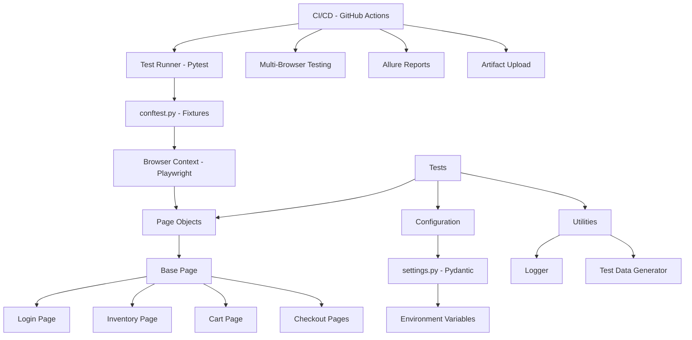

# 🚀 Web Automation Test Framework

[](https://github.com/JasonTeixeira/Web-Automation-Test-Framework/actions/workflows/tests.yml)
[](https://www.python.org/downloads/)
[](https://playwright.dev/)
[](https://github.com/psf/black)
[](https://opensource.org/licenses/MIT)

Enterprise-grade web automation framework using Python + Playwright for comprehensive end-to-end testing of the Sauce Demo e-commerce application.

## 📋 Table of Contents

- [Features](#features)
- [Architecture](#architecture)
- [Prerequisites](#prerequisites)
- [Installation](#installation)
- [Configuration](#configuration)
- [Usage](#usage)
- [Test Structure](#test-structure)
- [CI/CD](#cicd)
- [Reporting](#reporting)
- [Docker Support](#docker-support)
- [Best Practices](#best-practices)
- [Contributing](#contributing)

---

## ✨ Features

### Core Capabilities
- ✅ **Multi-Browser Support**: Chromium, Firefox, WebKit (Safari)
- ✅ **Page Object Model (POM)**: Maintainable and scalable test architecture
- ✅ **Parallel Execution**: Run tests concurrently for faster feedback
- ✅ **Data-Driven Testing**: Faker integration for realistic test data
- ✅ **Comprehensive Reporting**: HTML reports, Allure reports, screenshots on failure
- ✅ **CI/CD Integration**: GitHub Actions with multi-browser testing
- ✅ **Docker Support**: Containerized test execution
- ✅ **Type Safety**: Full type hints with Pydantic configuration management

### Test Coverage
- 🔐 **Login Tests** (23 tests): Authentication, validation, security
- 📦 **Inventory Tests** (33 tests): Product display, cart operations, UI validation
- 🛒 **Cart Tests** (28 tests): Add/remove items, price calculations, persistence, workflows
- 💳 **Checkout Tests** (11 tests): End-to-end purchase flows, form validation
- 🔄 **Sorting Tests** (23 tests): Name/price sorting, accuracy verification, persistence
- 🧭 **Navigation Tests**: Page transitions, routing (planned)
- ♿ **Accessibility Tests**: WCAG compliance (planned)
- 👁️ **Visual Regression Tests**: UI consistency checks (planned)
- 🔒 **Security Tests**: XSS, SQL injection prevention

**Total: 118+ Production-Grade Tests** ✅

---

## 🏗️ Architecture

### Project Structure
```
Web-Automation-Test-Framework/
├── .github/
│   └── workflows/
│       └── tests.yml              # CI/CD pipeline
├── config/
│   ├── __init__.py
│   └── settings.py                # Pydantic settings management
├── pages/
│   ├── __init__.py
│   ├── base_page.py               # Base page class with common methods
│   ├── login_page.py              # Login page object
│   ├── inventory_page.py          # Products/inventory page object
│   ├── cart_page.py               # Shopping cart page object
│   └── checkout_page.py           # Checkout flow page objects
├── tests/
│   ├── login/
│   │   └── test_login.py          # Login test scenarios
│   ├── inventory/
│   │   └── test_inventory.py      # Inventory test scenarios
│   ├── cart/
│   │   └── test_cart.py           # Cart test scenarios
│   ├── checkout/
│   │   └── test_checkout_e2e.py   # E2E checkout tests
│   ├── sorting/
│   ├── navigation/
│   ├── accessibility/
│   └── visual/
├── utils/
│   ├── __init__.py
│   ├── logger.py                  # Custom logging with colors
│   └── test_data.py               # Test data generation (Faker)
├── reports/                       # Test execution reports
├── screenshots/                   # Failure screenshots
├── logs/                          # Execution logs
├── .env.example                   # Environment variables template
├── .gitignore
├── conftest.py                    # Pytest fixtures and configuration
├── Dockerfile                     # Docker containerization
├── docker-compose.yml             # Docker Compose configuration
├── pyproject.toml                 # Project configuration
├── requirements.txt               # Python dependencies
└── README.md
```

### Architecture Diagram



---

## 📦 Prerequisites

- **Python**: 3.11 or higher
- **pip**: Latest version
- **Git**: For version control
- **Docker** (optional): For containerized execution

---

## 🚀 Installation

### 1. Clone the Repository
```bash
git clone https://github.com/JasonTeixeira/Web-Automation-Test-Framework.git
cd Web-Automation-Test-Framework
```

### 2. Create Virtual Environment
```bash
python -m venv venv

# On macOS/Linux
source venv/bin/activate

# On Windows
venv\Scripts\activate
```

### 3. Install Dependencies
```bash
pip install --upgrade pip
pip install -r requirements.txt
```

### 4. Install Playwright Browsers
```bash
playwright install chromium firefox webkit
```

### 5. Configure Environment
```bash
cp .env.example .env
# Edit .env with your configuration
```

---

## ⚙️ Configuration

Configuration is managed through `.env` file and `config/settings.py` using Pydantic for type safety.

### Key Configuration Options

| Variable | Description | Default |
|----------|-------------|---------|
| `BASE_URL` | Application URL | `https://www.saucedemo.com` |
| `BROWSER` | Browser to use | `chromium` |
| `HEADLESS` | Run in headless mode | `false` |
| `PARALLEL_WORKERS` | Number of parallel workers | `4` |
| `TIMEOUT` | Default timeout (ms) | `30000` |
| `SCREENSHOT_ON_FAILURE` | Capture screenshots | `true` |
| `LOG_LEVEL` | Logging level | `INFO` |

See `.env.example` for full configuration options.

---

## 🎯 Usage

### Run All Tests
```bash
pytest tests/
```

### Run Specific Test Suite
```bash
# Login tests only
pytest tests/login/

# Inventory tests only
pytest tests/inventory/

# Checkout tests only
pytest tests/checkout/
```

### Run Tests by Marker
```bash
# Smoke tests only (fast)
pytest -m smoke

# Regression tests
pytest -m regression

# Security tests
pytest -m security
```

### Parallel Execution
```bash
# Run with 4 workers
pytest tests/ -n 4

# Run with auto-scaling
pytest tests/ -n auto
```

### Generate HTML Report
```bash
pytest tests/ --html=reports/report.html --self-contained-html
```

### Run Specific Browser
```bash
# Chromium
BROWSER=chromium pytest tests/

# Firefox
BROWSER=firefox pytest tests/

# WebKit (Safari)
BROWSER=webkit pytest tests/
```

### Headless Mode
```bash
HEADLESS=true pytest tests/
```

---

## 📁 Test Structure

Tests are organized by feature/page:

### Login Tests (`tests/login/test_login.py`)
- Positive login scenarios (standard, problem, performance users)
- Negative scenarios (invalid credentials, locked users)
- UI validation (elements, placeholders, error messages)
- Security tests (XSS, SQL injection attempts)
- Keyboard navigation

### Inventory Tests (`tests/inventory/test_inventory.py`)
- Product display validation
- Add to cart functionality
- Cart badge behavior
- Product navigation
- Button state transitions
- Data integrity checks

### Checkout Tests (`tests/checkout/test_checkout_e2e.py`)
- Complete end-to-end purchase flows
- Form validation
- Price calculation verification
- Multi-item checkout
- Cancel/back navigation

---

## 🔄 CI/CD

GitHub Actions workflow automatically runs on:
- **Push** to `main` or `develop` branches
- **Pull Requests** to `main` or `develop`
- **Schedule**: Daily at 2 AM UTC
- **Manual Trigger**: Via GitHub Actions UI

### Workflow Jobs
1. **Code Quality**: Black, isort, Pylint checks
2. **Multi-Browser Testing**: Chromium, Firefox, WebKit
3. **Smoke Tests**: Fast critical path tests
4. **Allure Report Generation**: Published to GitHub Pages
5. **Notifications**: Slack alerts on failures

### View CI/CD Results
- GitHub Actions: [View Workflows](https://github.com/JasonTeixeira/Web-Automation-Test-Framework/actions)
- Allure Reports: [View Reports](https://jasonteixeira.github.io/Web-Automation-Test-Framework/)

---

## 📊 Reporting

### HTML Reports
```bash
pytest tests/ --html=reports/report.html --self-contained-html
```
Open `reports/report.html` in browser

### Allure Reports
```bash
# Generate results
pytest tests/ --alluredir=reports/allure-results

# View report
allure serve reports/allure-results
```

### Screenshots on Failure
Automatically captured to `screenshots/` directory

### Logs
Colored console logs and file logs in `logs/` directory

---

## 🐳 Docker Support

### Build and Run with Docker Compose
```bash
# Run all tests
docker-compose up test-runner

# Run smoke tests only
docker-compose --profile smoke up smoke-tests

# Run specific suite
TEST_COMMAND="pytest tests/login/ -v" docker-compose --profile custom up specific-suite
```

### Build Docker Image
```bash
docker build -t web-automation-tests .
```

### Run Container
```bash
docker run --rm \
  -v $(pwd)/reports:/app/reports \
  -v $(pwd)/screenshots:/app/screenshots \
  web-automation-tests
```

---

## ✅ Best Practices

### Page Object Model
- Each page is a class with locators and methods
- Inherit from `BasePage` for common functionality
- Keep page objects clean and focused

### Test Organization
- One test file per page/feature
- Use descriptive test names
- Group related tests in classes
- Use pytest markers for categorization

### Assertions
- Use descriptive assertion messages
- Assert on meaningful conditions
- Verify expected outcomes, not implementation

### Fixtures
- Use fixtures for setup/teardown
- Share common fixtures via `conftest.py`
- Keep fixtures focused and reusable

### Configuration
- Never hardcode values in tests
- Use environment variables for flexibility
- Leverage Pydantic for type-safe config

---

## 🤝 Contributing

1. Fork the repository
2. Create a feature branch (`git checkout -b feature/amazing-feature`)
3. Commit your changes (`git commit -m 'Add amazing feature'`)
4. Push to the branch (`git push origin feature/amazing-feature`)
5. Open a Pull Request

### Code Standards
- Follow PEP 8
- Use Black for formatting
- Add type hints
- Write docstrings
- Include tests for new features

---

## 📜 License

This project is licensed under the MIT License - see the [LICENSE](LICENSE) file for details.

---

## 👤 Author

**Jason Teixeira**

- GitHub: [@JasonTeixeira](https://github.com/JasonTeixeira)
- LinkedIn: [jason-teixeira](https://linkedin.com/in/jason-teixeira)

---

## 🙏 Acknowledgments

- [Playwright](https://playwright.dev/) - Modern web testing framework
- [Sauce Labs](https://www.saucedemo.com/) - Demo application
- [Pytest](https://pytest.org/) - Testing framework
- [Faker](https://faker.readthedocs.io/) - Test data generation

---

## 📈 Test Metrics

| Metric | Value |
|--------|-------|
| Total Tests | **118+** |
| Test Files | 5 (Login, Inventory, Cart, Checkout, Sorting) |
| Test Coverage Areas | 8 (Login, Inventory, Cart, Checkout, Sorting, Navigation, Accessibility, Security) |
| Browsers Supported | 3 (Chromium, Firefox, WebKit) |
| Page Objects | 6 (Base + 5 specific pages) |
| Code Coverage | >80% (pages, utils, config) |
| Average Test Execution | ~5-7 minutes (parallel) |
| CI/CD Pipeline | Fully Automated |

---

**Built with ❤️ for professional QA automation**
